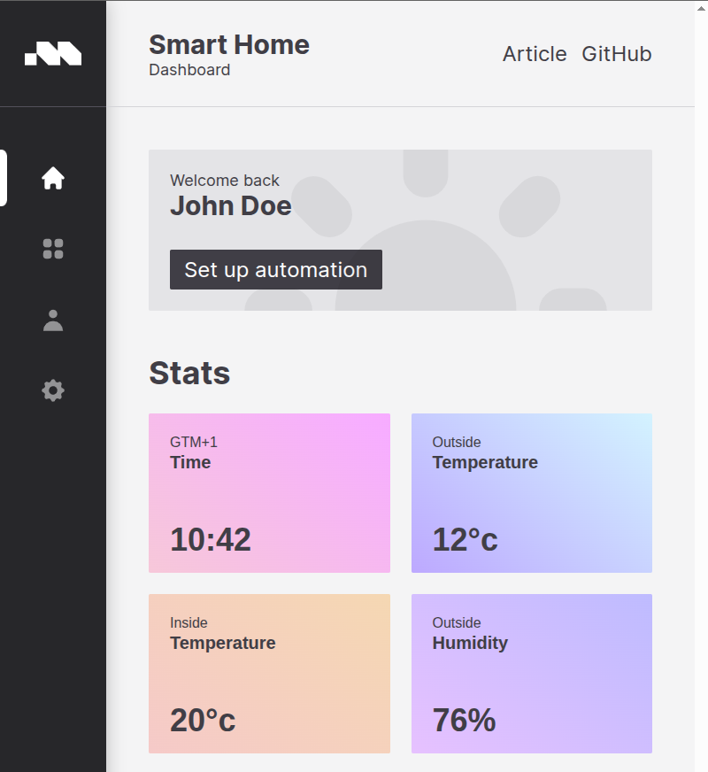
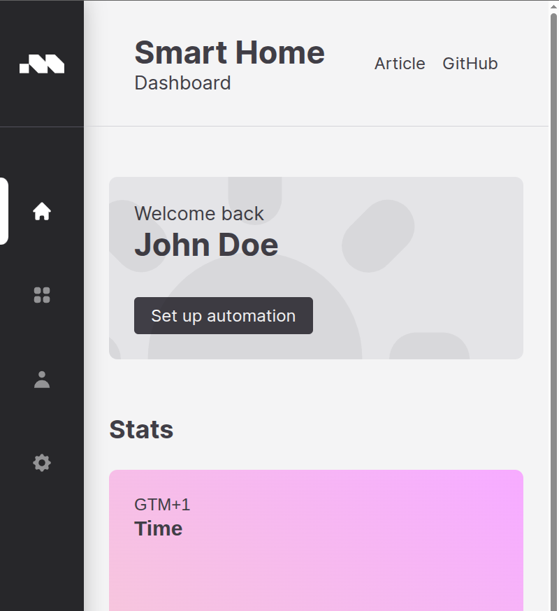

## Lit!

Native web components are a pain to build and design, mostly because the API is complicated and
naive implementations can have less than stellar performance.  [Lit](https://lit.dev) is a library,
originally developed by Google, that provides an alternative API for dealing with the web component
lifecycle, as well as a scheduling system that decorates your existing DOM with comment fields that
provide for all of the performance of a virtual DOM without any of the memory overhead.  Lit also
provides excellent ergonomics for defining properties, attributes, accessors to component internals,
as well as powerful idioms for defining events, boolean and string passing, and passing complex
JavaScript objects from one component to another.

The components here were originally developed for a similar library, [Minze](https://minze.dev/),
which was one of several such libraries with similar intent. They, and an [accompanying
article](https://tympanus.net/codrops/2022/03/04/creating-native-web-components/), were developed by
[Sergej Samsoneko](https://tympanus.net/codrops/author/sergej/) and published at Codrops.

Minze never quite took off; at the moment, Lit, [FAST](https://fast.design/), and
[Svelte](https://svelte.dev/) seem to be front-runners in the race to "make life easier for
component developers."  I needed some basic practice (and you probably do as well), so I decided to
see how quickly I could translate Sergej's work into Lit.

It took about half an hour. I even had macros (thank Gnu for
[Emacs](https://www.gnu.org/software/emacs/)) that would automatically re-write most of the code for
me. Oh, by the way: *No AI was involved in developing this code.* Just human talent.

The first thing Sergej developed was the accordion, a variant of the `<summary>/<details>`
component with a few nice visuals.  So let's do the same thing:

## Accordion

Here's how we use an accordion:

```
<sh-accordion>
  <div slot="summary">Stats</div>
  <div slot="details">Bacon ipsum dolor amet frankfurter pork loin filet mignon pastrami, pork
  prosciutto biltong strip steak sirloin cow shoulder spare ribs andouille.</div>
</sh-accordion>
```

First, all web components have a dash in their name. 

Second, most web components have a shadowDOM, which is a private DOM context with its own CSS and
its own scope. The open and close tags of a component define that scope, a sort of border between
what is inside and what is out. Browsers provide all HTML tags with a rectangle of rendering space,
a place in which the component is drawn, and when a component is rendered, that rectangle is filled
with the contents of the shadowDOM, hiding what you see in the lightDOM or, with slots, moving them
around.

A `slot` is a place defined in the web component where the content named to it will be placed.
They're a convenient way to provide content from the parent DOM context and control where, visually,
in the component that content will appear. Despite this placement, they're also still within the
parent DOM context and get they're styling from that context, *not* the CSS of the web component's
shadowDOM. 

(I will use the phrase "parent DOM context" where most tutorials will say "the lightDOM", because I
find that decpetive and confusing.  Almost all HTML can be nested in other HTML and still be
semantically correct; there's no reason to expect that the parent DOM context for a web component
will always be the top-level LightDOM context of the browser page.)

Our accordion will have a single HTML attribute, similar to the "checked" attribute of an input
checkbox; we want to know if the component is open or closed.  And we want to define the name:

``` Typescript
@customElement("sh-accordion")
export class ShAccordion extends LitElement {
    @property({ type: Boolean, reflect: true })
    open = false;
}
```

This is the most common idiom for defining a Lit element and an attribute on that element using
Typescript. We've created a LitElement class (which extends the browser's native HTLMElement),
decorated it with the instruction that says "Register this as `sh-accordion` with the browser", and
defined a single property, `open`.  The arguments to the `@property` decorator tell it that the
attribute is just a name without an accompanying value, and that when the propery is changed *within
the component*, the name should be added or removed from the host tag, the `sh-accordion` tag.

We have to render this thing, so let's do that.  We are going to add this method to our
`ShAccordion` class:


``` Typescript
    render() {
        const toggleOpen = () => {
            this.open = !this.open;
        };

        return html`
            <div class="title" @click=${toggleOpen}>
                <slot name="summary"></slot>
                <svg xmlns="http://www.w3.org/2000/svg" width="24" height="24" viewBox="0 0 20 20"  fill="currentColor" class="arrow">
                    <path
                        fill-rule="evenodd" clip-rule="evenodd"
                        d="M5.293 7.293a1 1 0 011.414 0L10 10.586l3.293-3.293a1 1 0 111.414 1.414l-4 4a1 1 0 01-1.414 0l-4-4a1 1 0 010-1.414z"
                    />
                </svg>
            </div>
            <slot name="details"></slot>
        `;
    }
```

A couple of things to note.  First, identify where the slots are.  The content from our first
example will be placed where they are named.

Next, note the `@click` syntax used to identify an event. The `@` symbol uses the eventName, and is
not limited to browser-native events; if you add your own event to the system, like "user-error",
you can `@user-error` and it will catch that error if the error passes through this component during
the [bubble
phase](https://developer.mozilla.org/en-US/docs/Learn_web_development/Core/Scripting/Event_bubbling).

Third, note where we've placed the accompanying function. It's inside the `render()` function,
because we want it to know that `this` means "this component instance". This is a short and simple
event handler, but it does mean that the browser will create a new copy of this function for *every
render* on the screen, *every time*. Alternatively, you can use [function binding
techniques](https://developer.mozilla.org/en-US/docs/Web/JavaScript/Reference/Global_Objects/Function/bind)
or class-based arrow functions to create a new copy of this function with the right reference only
once, when the component is rendered.

But the semantics are trivial.  "When the user clicks the summary, toggle the value of `this.open`."
That, in turn, causes Lit to re-render the `sh-accordion` tag with the attribute `open` added (or
removed, if it was present), because we made `open` be `reflect: true`.

But how does it show the details?  That's a bit of CSS magic.  All Web Components have their own
private CSS, unrelated to the content around them.  That presents a huge challenge in making large
component collections look harmonious, and a lot of engineering effort is being spent right now
figuring out how to make that all work.

But adding CSS to Lit is pretty easy.  I'm going to avoid *most* of the CSS, but let's see how the
`open` feature works.  At the top of our class, we're going to provide the CSS:

``` Typescript
@customElement("sh-accordion")
export class ShAccordion extends LitElement {
    static styles = [css`
        ::slotted([slot="details"]) {
            display: none;
            padding: 1rem;
        }
    
        :host([open]) ::slotted([slot="details"]) {
            display: block;
        }
    `];
```

Importantly, the `styles` field is *static*.  All instances of our accordion always get the same
CSS.  In Sergej's original, the value of `display` was manipulated dynamically, and every instance
of accordion had its own dynamically allocated CSS.  This is fine for small components, but if you
have hundreds of them and they have fairly large CSS definitions, this can waste memory and be a
performance hit.

Instead of fiddling with the CSS, I've taken a more modern approach and decided to let the browser
handle the magic.

The `::slotted([slot="details"])` pseudo-element allows us to *reach up* to the slotted details and
style it.  The reach of `::slotted()` is limited; we can't reach into the details itself with CSS, and
lots of combinators don't work with `::slotted()` (and it's *reach down* equivalent, `::part()`),
but for our purposes this is all we need.  This starts off saying that the the default case is
"don't show `slot="details"`.

But *then*, I have the `:host([open]) ::slotted([slot="details"])` clause, which says "If the host
tag has an attribute named `open` present, use this rule instead." Which now displays the details.

## Elision!

Sergej's tutorial does similar things with the `sh-switch` and `sh-card` components. I'm going to
skip most of the pedagogy with those two, but I'll focus on a couple of places where things are
different.

In `sh-card`, there's an attribute named `top-line`, but dashes aren't viable JavaScript names.
Minze handles the translation automagically, but Lit requires a declaration to go with its more fine
control of the properties, uh, properties. So we can declare the variable name completely
independent of how its associated attribute appears in the HTML with an argument to `@property`:

``` Typescript
    @property({ type: String, attribute: "top-line" })
    topLine?: string;
```

In `sh-switch`, we have to make the *whole switch*, not just the little button for that switch, be
reactive.  To handle that, we will need to add an event handler to the `constructor()`, such that it
effects the entire component, and has a lifespan as long as the component is present on-screen:

```
    constructor() {
        super();
        this.addEventListener("click", () => { this.active = !this.active; });
    }
```

Just as there are different ways to define an event handler, there are different places to define an
event listener. Here, we just want to handle the `click`, so we've put it on what JavaScript calls
`this` and CSS calls `:host`. The most common way is to use the `@eventName` syntax to capture
events on elements within the component. 

If you ever need to handle events in a dynamic way, or listen for events from *outside* the
component, you would use the `connectedCallback()/disconnectedCallback()` lifecycle pair to add and
remove those event listeners as needed. Imagine a pop-up that needs a "if the user clicks outside
this area, dismiss the pop-up." You would need to use this technique to attach event listeners to
`window` for clicks outside the pop-up component, and remove them once they've done their job.

## Modification

This was a fun exercise, for me at least, in updating and modernizing something that already feels
pretty modern. Sergej's work is outstanding, and I tried as faithfully as I could to reproduce it. I
have made one very opinionated CSS change, replacing almost every instance of pixel-based sizing
with rem-based sizing.

The reason for this can be seen in the screenshots below.  I'm... old.  I'll be 60 in less than a
year.  I wear glasses when I write code.  Someday I'm going to have to tell my browser that I need
the default font size to be 24px, rather than the "default" default of 16px.

On the left is Sergej's pixel-based version when the default font size is 24px. It's *completely
unresponsive* to my request for a disability accomodation. It's locked down to 16px no matter how
hard I work at it. On the right is the REM-based version. It sizes correctly, scaling smoothly in a
way that lets the render engine and CSS fit everything on the page. (Using the browser's "zoom"
feature often creates horizontal scrolling.)  With the recent arrival of container queries and
[utopia scaling](https://utopia.fyi/), I expect most websites to become both evermore stylish and
accessible at the same time.

<div style="max-width: 64rem; width: 100%; display: flex; flex-direction: row; gap: 1rem">
<div></div> <div></div>
</div>

## Conclusion

Creating a web component isn't hard.  There's a lot to master, but it's no different from mastering
HTML and CSS and JavaScript anyway, and the lessons learned are applicable everywhere.

This is obviously a static demo.  For a real application, you would have to define a top-level
state, and from where each component gets its data.  Lit supplies both `Context` and `Signals`, has
plug-ins for Internationalization, and much much more.  It's a powerful collection of libraries, not
a framework, and mastering it will involve actually learning how the Web Platform works, rather than
letting the framework hide it all away from you.  The reward is a much more malleable web, one that
can dance.


